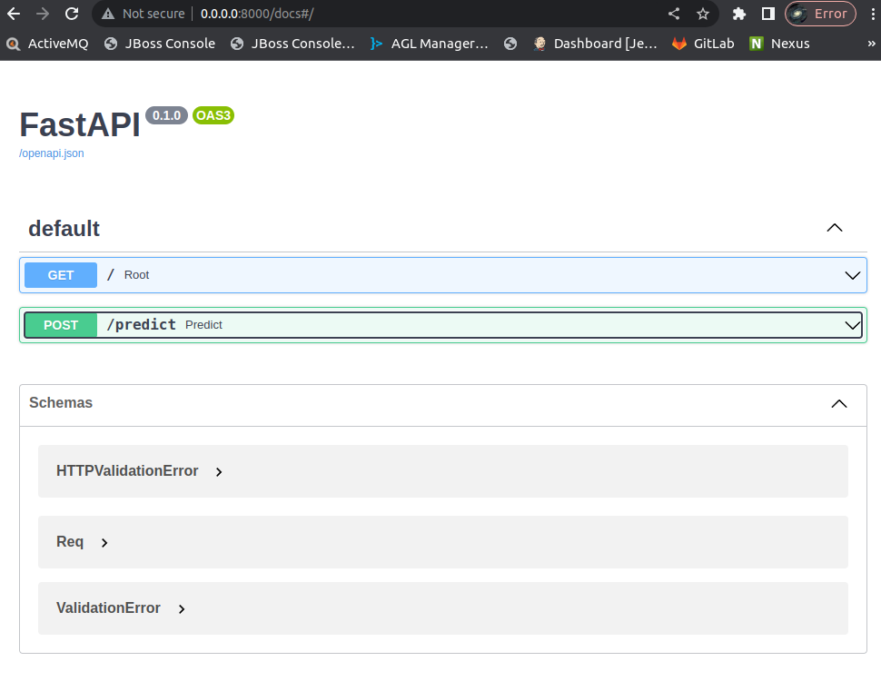
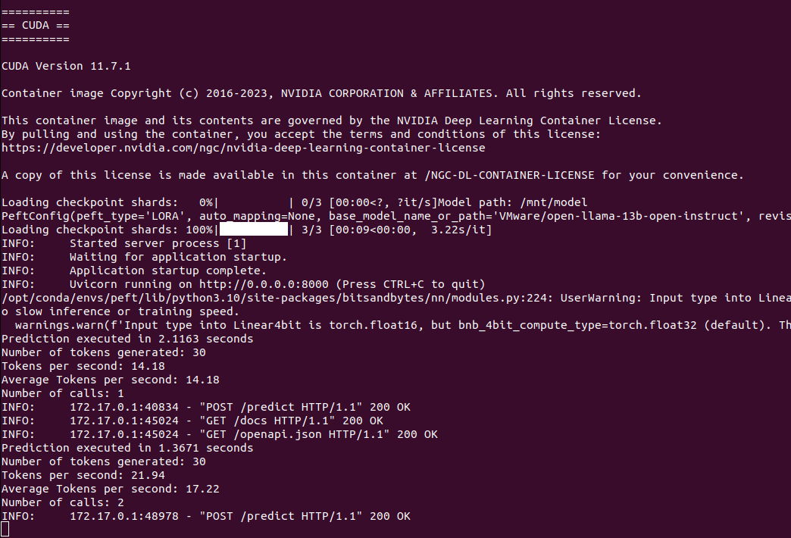

# Fast API inference endpoint (for LORA)

This tool start a container with CUDA 11.7.1 (NVidia GPU) running a Fast API server. 

It allows a LORA (int4 or int8) fined tuned model with [Transformers](https://github.com/huggingface/transformers) and [PEFT](https://github.com/huggingface/peft) to run within a Docker container.

Dockerfile based on [HuggingFace PEFT](https://github.com/huggingface/peft/blob/main/docker/peft-gpu/Dockerfile).

Exposed endpoint:

```json
/predict

{
  "prompt": "Machine learning is:",
  "max_new_tokens": 30,
  "temperature": 0.2,
  "repetition_penalty": 1.2,
  "num_beams": 1
}
```


## Prerequisite


You need a NVidia GPU, NVidia [drivers](https://docs.nvidia.com/datacenter/cloud-native/container-toolkit/latest/install-guide.html) and [nvidia-container-toolkit](https://github.com/NVIDIA/nvidia-container-toolkit) and [Docker](https://hub.docker.com/) installed

This container does not work on Apple Silicon.

## Limitations

Right now this container only support LORA PEFT model not merged (ie adapter on top of base model).

Also multiple GPUs are not supported for now.

## Endpoint documentation

OpenAPI documentation of endpoints are available [here](http://0.0.0.0:8000/docs)




## Running

To build the container:

```sh
sudo docker build . -t peft-gpu-inference:11.7.1
```

To use DockerHub pre-builded container

```sh
sudo docker run --gpus all -p 8000:8000 -v [model_path]:/mnt/model -v [path_cache_huggingface_hub]:/mnt/.cache/huggingface/hub -e LORA="int4" fbellame/peft-gpu-inference:11.7.1
```




To test:

```sh
curl -X 'POST' \
  'http://0.0.0.0:8000/predict' \
  -H 'accept: application/json' \
  -H 'Content-Type: application/json' \
  -d '{
  "prompt": "Machine learning is:",
  "max_new_tokens": 30,
  "temperature": 0.2,
  "repetition_penalty": 1.2,
  "num_beams": 1
}'
```

Response:
```json
{
  "prediction": "\nA method of training a computer to learn automatically from data and perform complex tasks without being explicitly programmed.\nAn approach to artificial intelligence based on the",
  "generated_tokens": 30
}
```
