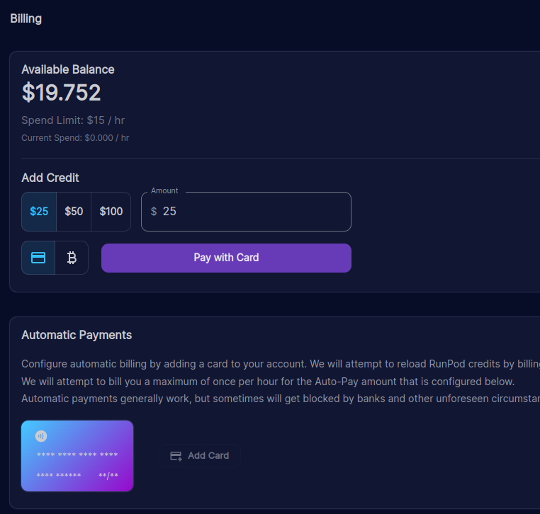
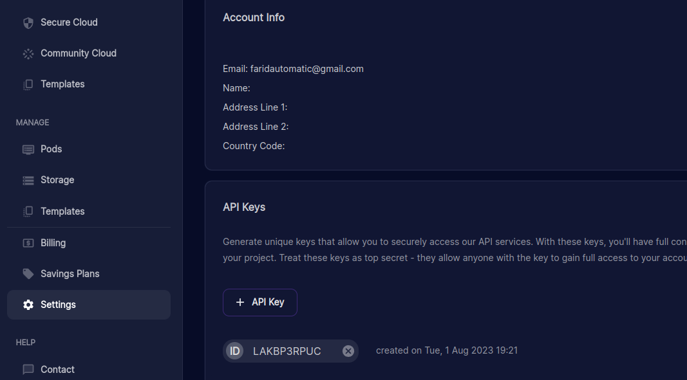
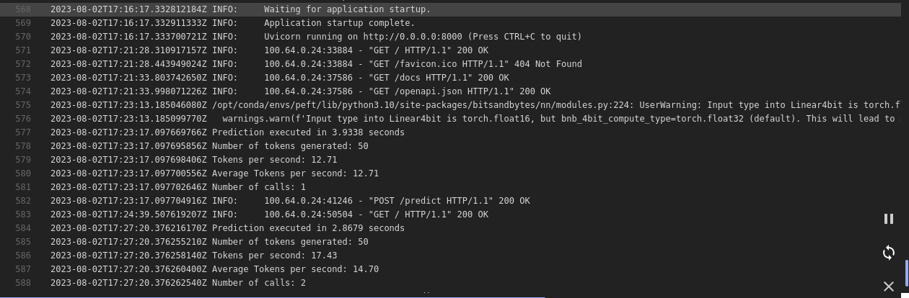
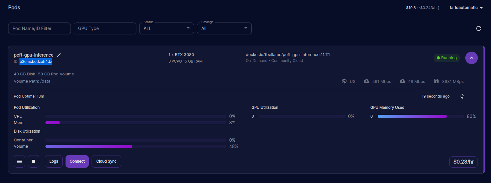
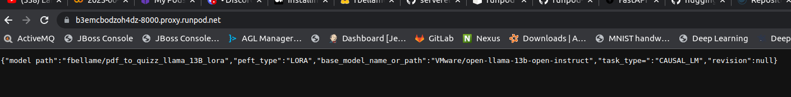
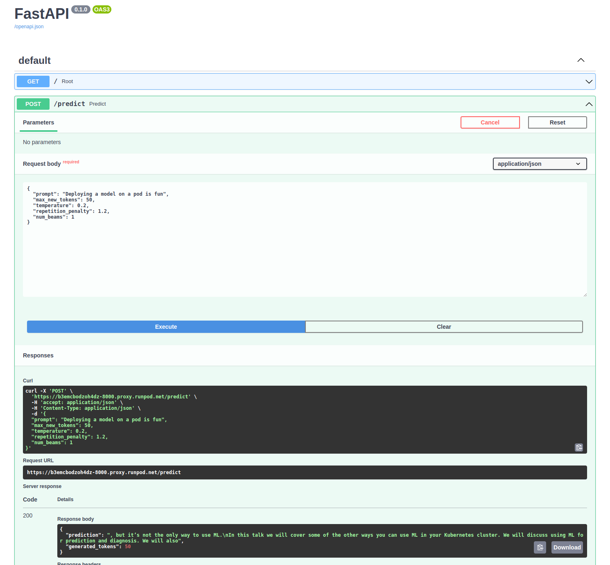
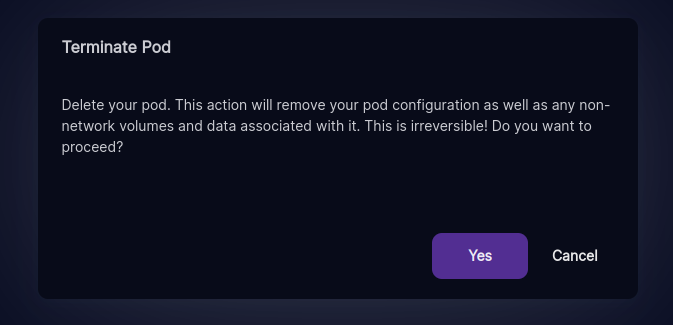

# Fast API inference endpoint (local and cloud RunPod)

This tool start a container with CUDA 11.7.1 (NVidia GPU) running a Fast API server to expose a fine tuned LLM. 

It allows a LORA (int4 or int8) fined tuned model with [Transformers](https://github.com/huggingface/transformers) and [PEFT](https://github.com/huggingface/peft) to run within a Docker container.

Dockerfile based on [HuggingFace PEFT](https://github.com/huggingface/peft/blob/main/docker/peft-gpu/Dockerfile).

Exposed endpoint:

```json
/predict

{
  "prompt": "Machine learning is:",
  "max_new_tokens": 30,
  "temperature": 0.2,
  "repetition_penalty": 1.2,
  "num_beams": 1
}
```


## Prerequisite

### Local

You need a NVidia GPU, NVidia [drivers](https://docs.nvidia.com/datacenter/cloud-native/container-toolkit/latest/install-guide.html) and [nvidia-container-toolkit](https://github.com/NVIDIA/nvidia-container-toolkit) and [Docker](https://hub.docker.com/) installed

This container does not work on Apple Silicon.

### Runpod Cloud

If you don't have GPU it's fine you can also deploy your model on cloud **runpod** with a GPU.

By default it will deploy *fbellame/pdf_to_quizz_llama_13B_lora* int4 fine tuned model on a **NVIDIA GeForce RTX 3080 10 Go VRAM runpod**, cost about **0.24$/hour**

## Limitations

Right now this container only support LORA PEFT model not merged (ie adapter on top of base model).

Also multiple GPUs are not supported for now.

## Endpoint documentation

OpenAPI documentation of endpoints are available [here](http://0.0.0.0:8000/docs)


## Running

### Local deployment:

To build the container:

```sh
sudo docker build . -t peft-gpu-inference:11.7.1
```

To use DockerHub pre-builded container to run locally:

```sh
# specify model name on HuggingFace hub
# -e MODEL_NAME="fbellame/pdf_to_quizz_llama_13B_lora"

# For local adapter LORA model set both:
# -e BASE_MODEL_DIR="${PWD}"
# -e MODEL_NAME="data"

# specify LORA int type int4 or int8, default value is int4
# if specified "" (empty string) will use default fp32 or fp16 depending of model config
# -e LORA="int4"

# start a docker container FastApi endpoint for inference on $MODEL_NAME (HuggiinFace hub) with LORA int4 (default)
sudo docker run --gpus all -p 8000:8000 -v ${PWD}/data:/data -e MODEL_NAME="fbellame/pdf_to_quizz_llama_13B_lora" fbellame/peft-gpu-inference:11.7.1

# start a docker container FastApi endpoint for inference on path /data (local path within docker ir external path ${PWD}/data) with LORA int8
sudo docker run --gpus all -p 8000:8000 -v ${PWD}/data:/data -e BASE_MODEL_DIR="/" -e MODEL_NAME="data" -e LORA="int8" fbellame/peft-gpu-inference:11.7.1
```

**Explanations:**<br>

``` sh
--gpus all:  expose computer GPU to Docker container
```

``` sh
-p 8000:8000 : map port internal docker port 8000 of FastAPI to external 8000 port
```

``` sh
<b>-v ${PWD}/data:/data :</b> map local ${PWD}/data containing the local fine tuned model and huggingFace cache fo-e LORA="int4"r base model to /data directory within the container
```


To test:

```sh
curl -X 'POST' \
  'http://0.0.0.0:8000/predict' \
  -H 'accept: application/json' \
  -H 'Content-Type: application/json' \
  -d '{
  "prompt": "Machine learning is:",
  "max_new_tokens": 30,
  "temperature": 0.2,
  "repetition_penalty": 1.2,
  "num_beams": 1
}'
```

Response:
```json
{
  "prediction": "\nA method of training a computer to learn automatically from data and perform complex tasks without being explicitly programmed.\nAn approach to artificial intelligence based on the",
  "generated_tokens": 30
}
```

### Runpod deploiement:

First you need to put credit on your Runpod account, it's really simple, for exemple I put 20$ for my experiments and you can do a lot of them if you don't forget to kill the pod!!!

Otherwise you will eat only the credit you put on it, it's a nice safety to avoid bad surprises!!!




Create an API key:




To help creating a pod, customize the following [script to your needs](deploy_pod.sh):

```sh
#/bin/bash

# deploy fbellame/pdf_to_quizz_llama_13B_lora model on a NVIDIA GeForce RTX 3080 10 Go VRAM runpod, cost about 0.24$/hour

export RUNPOD_KEY="YOUR_KEY"


curl --request POST \
  --header 'content-type: application/json' \
  --url 'https://api.runpod.io/graphql?api_key=LAKBP3RPUCBOR2MRAZF4SHC2221O94NK8XLXRJJX' \
  --data '{"query": "mutation { podFindAndDeployOnDemand( input: { cloudType: ALL, gpuCount: 1, volumeInGb: 50, containerDiskInGb: 40, gpuTypeId: \"NVIDIA GeForce RTX 3080\", name: \"peft-gpu-inference\", imageName: \"docker.io/fbellame/peft-gpu-inference:11.7.1\", dockerArgs: \"\", ports: \"8000/http\", volumeMountPath: \"/data\" } ) { id imageName env machineId machine { podHostId } } }"}'
```

Creating the pod is fast but you have to remenber, pod need to download the docker image then, once the image is spinned up, LLM model needs to be downloaded in /data mount, so give it a few minutes, anyway you can monitor that with runpod logs:



So you get through all this steps, congratulations, now you only need to pick up the instance pod id:



Now you can call the endpoint by building the url with the https://[pod-id]-80000.proxy.runpod.net 

If your deployement is successfull you should see :



Now you can call the endpoint with the help of openapi endpoint documentation:



Now **DON'T FORGET TO KILL** the pod:

